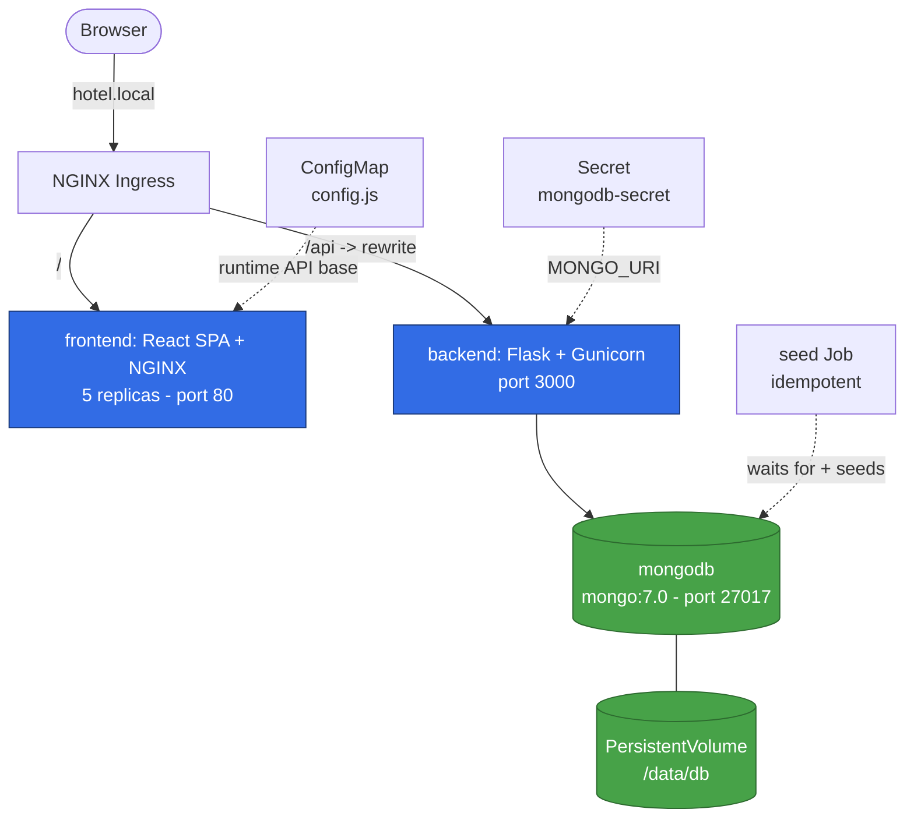
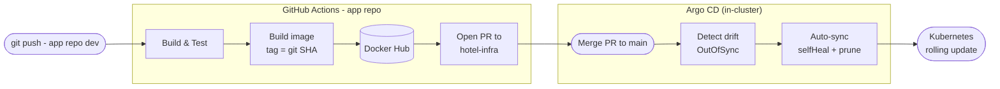

<div align="center">

# 🏨 Hotel Platform — GitOps Infrastructure

**Declarative, self-healing delivery of a 3-tier microservices app to Kubernetes — powered by Argo CD & GitHub Actions.**

Every commit flows from `git push` to a running Pod with **zero manual `kubectl apply`**. Git is the single source of truth; the cluster continuously reconciles itself to match it.

<br/>


</div>

---

## 📌 What this project demonstrates

This repository is the **infrastructure & delivery layer** for a hotel-booking application. It is deliberately built to showcase production-minded DevOps practices end to end:

- **GitOps with Argo CD** — the cluster's desired state lives in Git; Argo CD reconciles automatically with `selfHeal` (drift correction) and `prune` (garbage collection).
- **Fully automated CI/CD** — application repos build, test, push immutable images, and open a Pull Request against *this* repo. Merge = deploy.
- **Immutable, traceable image tags** — every image is tagged with the **Git commit SHA**, so any running Pod is traceable back to an exact source commit (`:latest` kept only for convenience).
- **Declarative Kubernetes with Kustomize** — one `kustomization.yaml` composes the whole stack; a single Argo CD `Application` owns it.
- **12-Factor runtime configuration** — the frontend image is built once and configured **at runtime** via a mounted `config.js` (ConfigMap), so the same artifact ships to every environment.
- **Operational hygiene** — readiness/liveness probes, CPU/memory requests & limits, a persistent volume for stateful data, and an **idempotent** database seed Job.
- **Single-origin ingress** — one host serves the SPA and proxies the API under `/api`, eliminating CORS and simplifying the browser's trust model.

---

## 🏗️ Architecture

### Runtime topology (inside the cluster)



| Component | Role | Tech | Port | Exposure | Notes |
|-----------|------|------|------|----------|-------|
| **frontend** | User interface | React SPA served by NGINX | 80 | ClusterIP | 5 replicas · runtime config via ConfigMap · probes · resource limits |
| **backend** | REST API | Python 3.12 · Flask · Gunicorn | 3000 | ClusterIP | `/health` probes · `MONGO_URI` from Secret · resource limits |
| **mongodb** | Database | mongo:7.0 | 27017 | ClusterIP | Backed by a PVC to survive Pod restarts |
| **seed** | Data bootstrap | mongo:7.0 (`mongosh`) | — | Job | Waits for DB, then seeds hotels idempotently |
| **ingress** | Edge routing | NGINX Ingress | — | LB/Host | `/` → frontend, `/api(/\|$)(.*)` → `backend:3000` with prefix rewrite |

> The browser only ever talks to **one origin**. `/` serves the SPA; `/api/hotels` is rewritten to `/hotels` on `backend:3000`. Two `Ingress` objects are used intentionally so the API rewrite annotation is isolated from the SPA path.

---

## 🔄 The GitOps delivery pipeline

The core of the project. A developer never touches the cluster — they just push code.



**How it works, step by step:**

1. A developer pushes to `dev` in an **application** repo (`hotel-backend` / `hotel-frontend`).
2. **GitHub Actions** builds the app, runs a smoke test, and builds a Docker image tagged with the **commit SHA** (+ `:latest`), pushing both to **Docker Hub**.
3. A second job checks out **this repo** and bumps the image tag in `k8s/<component>/deployment.yaml`, then opens a **Pull Request** (`peter-evans/create-pull-request`).
4. A human **reviews and merges** the PR into `main` — the only manual gate, and the audit trail.
5. **Argo CD** (tracking `main`, path `k8s`) detects the change, shows `OutOfSync`, and **auto-syncs**.
6. Kubernetes performs a **rolling update**; Argo CD reports `Synced / Healthy`.

> ✅ **Validated end-to-end.** A backend commit was traced from `git push` all the way to the live Deployment image flipping from `:3` to its full commit SHA, with Argo CD reconciling automatically — no manual `kubectl` in the path.

---

## 📂 Repository structure

```
hotel-infra
├── argocd/
│   └── hotel-app.yaml          # Single Argo CD Application → path k8s/ (owns the whole stack)
├── k8s/
│   ├── kustomization.yaml      # Composes every manifest below
│   ├── namespace.yaml          # namespace: hotel
│   ├── mongodb/                # Secret + PVC + Deployment + Service
│   ├── backend/                # Deployment + Service (ClusterIP :3000)
│   ├── frontend/               # Deployment + Service + ConfigMap (config.js) + Ingress (/, /api)
│   └── seed/                   # Idempotent seed Job + ConfigMap (seed script)
├── scripts/
│   ├── seed_hotels.js          # Source of truth for demo hotel data
│   └── smoke_test.py           # Backend ↔ MongoDB smoke test
├── docs/
│   └── VALIDATION.md           # End-to-end test & validation report (incident log + raw output)
├── docker-compose.yml          # Full local stack (adds mongo-express)
├── .env.example                # Environment template
└── README.md
```

---

## 🚀 Deploy via Argo CD (GitOps — recommended)

A **single** Argo CD `Application` owns the entire stack (namespace, DB, backend, frontend, seed) via Kustomize:

```bash
kubectl apply -f argocd/hotel-app.yaml
```

```yaml
# argocd/hotel-app.yaml (excerpt)
source:
  repoURL: https://github.com/DolevAtik/hotel-infra.git
  targetRevision: main
  path: k8s
syncPolicy:
  automated:
    prune: true       # delete resources removed from Git
    selfHeal: true    # revert manual cluster drift back to Git
  syncOptions:
    - CreateNamespace=true
```

From here on, **Git is the deploy button** — merge to `main` and the cluster follows.

---

## ⚙️ Deploy manually with Kustomize (no Argo CD)

The same manifests apply directly, in dependency order (namespace → storage/secret → workloads → seed):

```bash
kubectl apply -k k8s/
```

---

## 💻 Run locally (Docker Compose)

Great for developing without a cluster. Copy `.env.example` → `.env` and fill in credentials:

```env
MONGO_ROOT_USERNAME=admin
MONGO_ROOT_PASSWORD=change-me
ME_USERNAME=admin
ME_PASSWORD=change-me
```

```bash
docker compose up -d --build
```

| Service        | URL                          |
|----------------|------------------------------|
| Frontend       | http://localhost:8080        |
| Backend API    | http://localhost:3000        |
| mongo-express  | http://localhost:8081        |
| MongoDB        | mongodb://localhost:27017    |

```bash
docker compose down       # stop, keep data
docker compose down -v    # stop, wipe the data volume
```

---

## ✅ Verify a deployment

```bash
# Argo CD application health & sync state
kubectl get applications -n argocd
# → hotel   Synced   Healthy

# Everything in the app namespace
kubectl get all -n hotel

# Prove the running image matches the merged commit SHA
kubectl get deployment backend -n hotel \
  -o=jsonpath="{.spec.template.spec.containers[0].image}"
# → dolevatik/hotel-backend:<git-sha>

# Seed Job output (inserted / already-exists + total)
kubectl logs -n hotel job/hotel-seed
```

> 📄 A full, reproducible validation run — the nine checks above with **real output**, plus an honest **incident log** of the failures hit and fixed along the way — is documented in **[docs/VALIDATION.md](docs/VALIDATION.md)**.

---

## 🔒 Security notes

- `k8s/mongodb/secret.yaml` ships **sample credentials only**. Replace them and never commit real secrets — use [Sealed Secrets](https://github.com/bitnami-labs/sealed-secrets) or [External Secrets Operator](https://external-secrets.io/) for production.
- Docker Hub and GitHub credentials (`DOCKER_USERNAME`, `DOCKER_PASSWORD`, `PAT`) live in **GitHub Actions secrets**, never in the repo.
- Merging to `main` is the intentional human gate on every deploy — the change history is the audit log.

---

## 🗺️ Roadmap

Honest next steps toward a production-grade platform:

- [ ] **Sealed Secrets / External Secrets** to remove plaintext credentials from Git
- [ ] **Observability** — Prometheus + Grafana dashboards and alerting
- [ ] **Progressive delivery** — Argo Rollouts (canary / blue-green) instead of rolling updates
- [ ] **App-of-Apps** pattern to scale to multiple environments (dev / staging / prod)
- [ ] **Policy & supply chain** — image scanning (Trivy) and admission policy (Kyverno/OPA)
- [ ] **TLS** at the ingress via cert-manager + Let's Encrypt

---

<div align="center">

**Built by [Dolev Atik](https://github.com/DolevAtik)** · DevOps Engineer

*Companion application repos: [`hotel-backend`](https://github.com/DolevAtik/hotel-backend) · [`hotel-frontend`](https://github.com/DolevAtik/hotel-frontend)*

</div>
